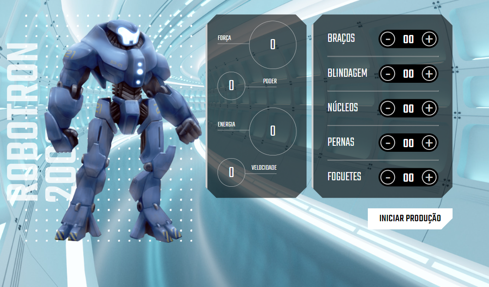

# Alura MIDI

> Robotron 2000

Projeto construído durante o curso JavaScript: manipulando o DOM, ministrado pela Alura.

[Clique aqui para acessar](https://paulomarquesdev.github.io/robotron-2000/)

## Tecnologias

- HTML e CSS
- JavaScript

## 💻 Projeto

O Robotron 2000 é uma página dinâmica de montagem de robôs, onde você escolhe a quantidade desejada de cada peça e vê de imediato como cada uma impacta nos atributos de seu robô.
